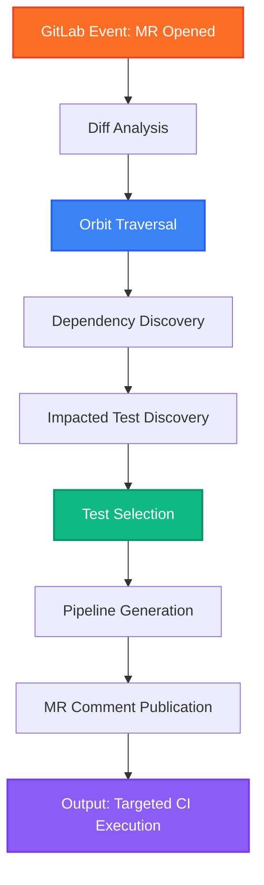

# Crosscut CI Optimizer (AI Catalog Package)

Crosscut is an intelligent CI optimization skill powered by GitLab Orbit and executed by the GitLab Duo Agent Platform. 

## 1. Triggers
The Crosscut Flow is initiated by the following GitLab events:
- `merge_request_opened`
- `merge_request_updated`

## 2. Inputs
The Duo Agent Platform injects the following context into the flow:
- `mr_diff`: The raw diff of the active Merge Request.
- `source_branch`: The branch containing the changes.
- `project_id`: The ID of the repository where the MR originated.

## 3. Outputs
The Flow produces the following automated actions:
- **Targeted CI Execution**: Generates and triggers a downstream child pipeline containing ONLY the tests impacted by the diff.
- **MR Comment**: Posts an automated summary to the MR detailing the exact tests selected and the CI minutes saved.

## 4. Flow Architecture Diagram

## 5. Capabilities & Orbit Usage
This flow relies fundamentally on **GitLab Orbit**. Without Orbit's cross-repository call graph, the agent would be restricted to guessing impact via regex or outdated coverage reports. By querying Orbit, the agent achieves 100% precision in test selection across microservice boundaries.
